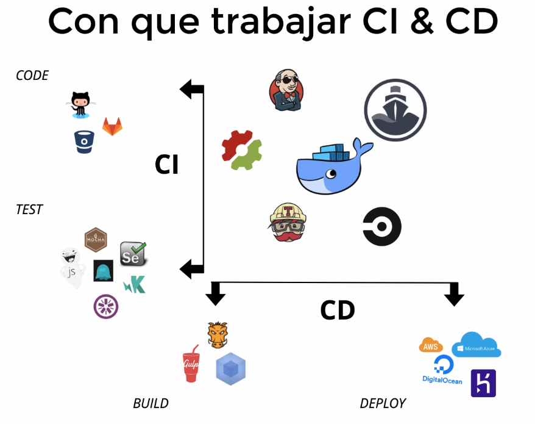

# DevOps


## Integración continua (CI)

  Se busca integrar el desarrollo con el despliegue. Es la práctica de integrar con
  anticipación y frecuencia a la sucursal principal. El meollo es en las **pruebas
  automatizadas** que permitan verificar que el código está correcto anter de implementarlo.

## Despliegue continuo (CD)

  Es el despliegue de código a producción tan pronto como esté listo.

  Existen dos tipos:

### Entrega continua

  El ser humano interviene en la última fase de la integración antes de llevarlo
  a producción. Ya sea para ajustarse a campañas publicitarias o en momentos del
  día más adecuado.

### Despliegue contino

  Todo el proceso de despliegue se hace de forma automática.

## Herramientas de despliegue



## Github actions

  > GitHub Actions makes it easy to automate all your software workflows.
  > Build, test, and deploy your code right from GitHub. Make
  > code reviews, branch management, and issue triaging work the way you want.

### Estructura básica

  Workflow -> Job -> Step -> Action

  Los workflows se escriben en archivos `.yml` en forma de instrucciones para que
  pueden ser leidos.

#### Ejemplo

  ```yml
# This is a basic workflow to help you get started with Actions

  name: CI

# Controls when the workflow will run
  on:
# Triggers the workflow on push or pull request events but only for the master
  branch
  push:
branches: [ master ]
pull_request:
branches: [ master ]

# Allows you to run this workflow manually from the Actions tab
workflow_dispatch:

# A workflow run is made up of one or more jobs that can run sequentially or in parallel
jobs:
# This workflow contains a single job called "build"
build:
# The type of runner that the job will run on
runs-on: ubuntu-latest

# Steps represent a sequence of tasks that will be executed as part of the job
steps:
# Checks-out your repository under $GITHUB_WORKSPACE, so your job can access
it
- uses: actions/checkout@v3

# Runs a single command using the runners shell
- name: Run a one-line script
run: echo Hello, world!

# Runs a set of commands using the runners shell
- name: Run a multi-line script
run: |
echo Add other actions to build,
     echo test, and deploy your project.
     ```
