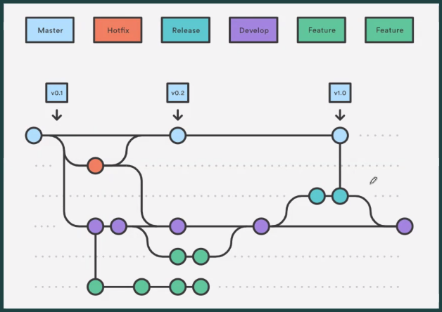

# SCRUM PROCESS

1. VISION: La idea del producto.
2. HISTORIAS DE USUARIO: Se plantean los requisitos del usuario en un lenguaje "humano" y una estimación del esfuerzo que conlleva.
3. PRODUCT BACKLOG: Es una lista de deseos organizada por importancia para el desarrollo.
4. SELECTED PRODUCT BACKLOG: Se seleccionan los backlogs que se desarrollarán en el sprint.
5. DESARROLLO DE SPRINT: Desarrollo y reuniones diarias.
6. NEW FUNCTIONALITY: Se presenta la nueva funcionalidad que se desarrolló en el sprint.
7. SPRINT REVIEW: Se hace un repaso del sprint y se presentan los resultados conseguidos.
8. RETROSPECTIVE: Se evalúa el flujo de trabajo del sprint.

## FLUJOS DE TRABAJO CON GIT

### TIPOS DE FLUJOS

  1. FLUJO DE TRABAJO CENTRALIZADO

  No se requiere varias ramas ya que solo se hacen commits a la rama principal, esto es muy común en trabajos individuales.

  2. RAMAS DE FUNCIONALIDADES

  El desarrollo de cada nueva característica se lleva a cabo en una rama independiente, de forma aislada y hasta que esté
  completamente finalizada y funcionando correctamente.

  Es una buena práctica manejar dos ramas principales: master y develop. En la segunda se integran las ramas de cada
  funcionalidad, y solo cuando ya se tiene plena seguridad para un lanzamiento se pasa a la master, etiquetándolo con un
  número de versión. Antes de master se puede pasar por una rama de release donde se dan las últimas pinceladas como la
  documentación.

  Si en el lanzamiento se presenta algún tipo de de error aparecerá una rama de hotfix que sale de master para solucionar
  los problemas y se integra a esta nuevamente apenas se resuelva.

  3. TRABAJO DE BIFURCACIÓN

  Cada desarrollador trabaja con un propio repositorio remoto con los cambios que se realizan y luego, una vez aprobados,
  se envían al repositorio remoto central. De igual forma, de la central se hará el pull al remoto propio para actualizar
  los archivos.

### DIRECTRICES

  1. Ramas transitorias.
  2. Minimización y simplificación de reversiones.
  3. Cumplimiento de una planificación de publicación.
