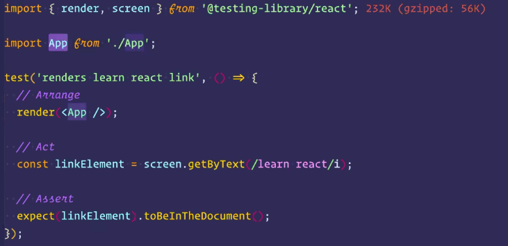

# Testing Library

Nace como una solución para crear test enfocado al Frontend, que difiere mucho a
como se solía hacer con enfoque de Backend. Este nuevo enfoque se basa en la
experiencia de usuario y la accesibilidad de los componentes de una página web.

## Patrón triple A

## Pruebas unitarias

Para hacer pruebas unitarias se debe hacer test de los componentes más simples.

